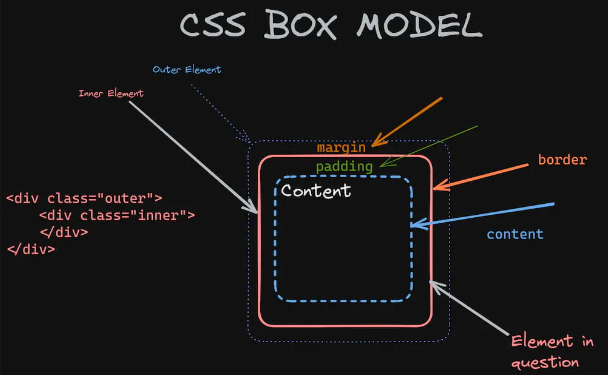

# webDevLearning
My personal essay on front-end learning journey through HTML, CSS, javascrypt and some useful content

>Esse documento será alimentado tanto por português quanto por inglês baseado em minha visão pessoal. A ideia geradora empenhasse em mostrar os conteúdos com certa divisão, seguindo HTML, CSS, JavaScrypt e quaisquer conteúdos adicionais, guardando seções de interações para sitações em trechos conveniêntes.

# HTML - HyperText Markup Language

|Linguagem de marcação utilizada para estruturar e definir o conteúdo de páginas web, baseada em **elementos/tags** que possuem funções especificas e **atributos** com **valores** personalizáveis que alteram sua aparência e comportamento. Estruturação baseada em aninhamento de elementos, os quais os descendentes herdam as características do ninho caso não tenham regras próprias.

# Estrutura básica de um arquivo HTML <!>

```
<!DOCTYPE html>
<html lang="pt-br">
    <head>
        <meta charset="UTG-8">
        <meta name="viewport" content="width=device-width, initial-scale=1.0">
        <title>My page</title>
    </head>
    <body>
        <h1>Hello World</h1>
    </body>
</html>
```

# Comentários em um arquivo HTML

`<!--comentário a ser lido mas não interpretado pela máquina-->`

# Tags
- marcadores utilizados para demonstrar o que aquele conteúdo representa, utilizado pelos algoritmos de busca para verificar a relevância do site em questão.

```
<header> - Cabeçalho do conteúdo
    <h1> - Titulos, Numeração mostra a hierarquia</h1>
</header>

<main> - Área do conteúdo principal
    <p> - Paragrafo.
        <a href="https://url.desejado ou nome_arquivo"> - Ancora o link entregue</a>
    </p>

    <nav> -     
        <link href="nome_arquivo ou https://url.do.site" rel="a relação do link">
    </nav>

    <section> - Sessão para divisão
        
    </section>


    
    <article> - Estruturador de textos
        <ol> - Lista ordenada
            <li> - Rlemento da lista </li>
        </ol>

        <ul> - Lista desordenada
            <li> - Mesma tag </li>
            <li> - Mudança de estilos no CSS </li>
        </ul>
    </article>
</main>
<footer>
    <p>Rodapé da página</p>
</footer>
```


# CSS - Cascading Style Sheets

|Linguagem de estilização utilizada para definir a apresentação visual dos conteúdos em páginas web, proporcionando aos desenvolvedores o controle necessário sobre a aparência e o comportamento visual dos elementos. Possuem diversas características e funcionalidades, bem como:

* **Seletores:** São utilizados para aplicar estilos a elementos específicos de uma página HTML, como tags, classes, IDs, atributos, entre outros.

* **Propriedades:** Definem como os elementos selecionados devem ser apresentados, incluindo cor, tamanho da fonte, margens, preenchimento, etc.

* **Hierarquia em Cascata:** O termo "cascata" refere-se à forma como as regras de estilo são aplicadas, com prioridades determinadas pela especificidade dos seletores e pela ordem de declaração. Sendo assim, direfentes regras podem afetas o mesmo elementos dependendo da hierarquai criada nos estilos

* **Responsividade:** CSS permite criar layouts responsivos que se adaptam a diferentes tamanhos de tela e dispositivos, utilizando técnicas como media queries e unidades flexíveis.

* **Modularidade e reutilização:** Estilos CSS podem ser organizados em arquivos separados e reutilizados em diversas páginas, facilitando a manutenção e a consistência visual de um site.

* **Compatibilidade:** CSS é suportado por todos os navegadores modernos e é uma tecnologia fundamental para a criação de interfaces web modernas e agradáveis ao usuário.

# Estrutura básica de um CSS global e um.

```
<head>
    <style>
        h1{
            font-family: Arial;
            text-align: center;
            color: RGB;
        }
    
        p {
            font-family: Arial;
            text-align: center;
            color: RGB;
        }
    
        a {
            color: value-1;
            text-decoration: none or underline(standart);
            property-3: value-3;
        }
    
        a:hover {
            color: value-2;
            text-decoration: underline;
        }
    </style>
        or
    <link href="style.css" rel="stylesheet">
</head>
```
- Cada linha dentro dos colchetes terá uma propriedade CSS e um valor, devendo terminar com ;

# Comentários em um arquivo CSS

`/*Comentário a ser lido mas não interpretado pela maquina*/`.

# Estado do elemento e suas implicações

O elemento `<a href="">ancora</a>`, quando estilizado simboliza todas as ancoras em seu estado padrão, os estilos entregues serão seguidos por todos os elementos que corresponderem a esse estado padrão.

Sendo assim, ao especificar `a:hover {texte-decoration: underline;}`, apenas o elemento ancora que possui o mouse acima dele herdará essa folha de estilo.

# Ordem de declaração para elementos CSS

A declaração de qual folha estilizará o elementos segue a ideia de especificidade, portanto, estilos inline são seguidos de estilos no body, com estilos externos tendo menos prioridade. Também vale salientar que a regra declarada por ultimo dentro de cada estilo prevalece.

# Seletores em CSS
| **Type**: Folha de estilo para elementos de um tipo ou grupos de tipos
```
<head>
    <style>
        p {;}
        h1 {;}
            or
        p, h1 {;}
    </style>
</head>
<body>
    <h1>Titulo</h1>
    <p>Paragrafo</p>
</body>
```
| **ID** : Especifíca qual elemento recebe aquele estilo
```
<head>
    <style>
        #nome{;}
            or
        p#nome{;}
    </style>
</head>
<body>
    <p id="nome">Paragrafo de id nome.</p>
</body>
``` 
- `#nome` ou `p#nome` Identifica especificamente o ID dado: regra seguida apenas por esse elemento, não nomeie diversos elementos com o mesmo ID.

| **Class** : Afeta quaisquer elementos que pertençam aquela classe.
```
<head>
    <style>
        .class{;}
    </style>
</head>
<body>
    <h1 ="class">Titulo da classe
    <p ="class">Paragrafo da classe</p>
</body>
``` 

# Combinações em CSS
| **Descendencia** :Qualquer elemento que, de alguma maneira, direta ou indireta, pertença aquela regra
>```
><style>
>    article p a {;}
></style>
>```
> Qualquer âncora aninha em uma lista que esteja em um article receberá esse estílo


| **Child** :Apenas elementos que obedecem a ordem direta de aninhamento receberão
>```
><style>
>    article > a {;}
></style>
>```
> Apenas uma âncora que esteja aninhada diretamente em um artigo receberá esse estilo, no caso abaixo, apenas a âncora dentro do article 2.
>```
><body>
>   <main>
>       <article id="1">
>           <p><a href=""></p>
>       </article>
>
>       <div></div>
>
>       <article id="2">
>           <a href="">
>       </article>
>   </main>
></body>
>```

# Propriedades comuns em CSS

```
<head>
    <style>
        h1, p {
            background-color: Define a cor de fundo;
            background-image: Define uma imagem de fundo;
            border: Define as propriedades da borda;
            border-radius: Define os cantos arredondados - px;
            box-shadow: Adiciona sombra ao elemento;
            color: Define a cor do texto;
            font-family: Define a fonte do texto;
            font-size: Define o tamanho do texto;
            font-weight: Define a espessura do texto;
            font-style: Define o estilo da fonte (normal, itálico, oblíquo);
            letter-spacing: Define o espaçamento entre as letras;
            line-height: Define a altura da linha;
            margin: Define a margem externa do elemento;
            opacity: Define a opacidade do elemento;
            padding: Define o espaçamento interno do elemento;
            text-align: Define o alinhamento do texto;
            text-decoration: Adiciona decoração (sublinhado, linha sobre o texto, etc.);
            text-shadow: Adiciona sombra ao texto;
            text-transform: Controla o capslock do texto (lowercase, uppercase, capitalize);
            transform: Aplica transformações 2D ou 3D;
            word-spacing: Define o espaçamento entre as palavras;
        }
        img {
            height: Define a altura da imagem;
            width: Define a largura da imagem; 
            max-height: Define a altura máxima da imagem;
            max-width: Define a largura máxima da imagem;
            min-height: Define a altura mínima da imagem;
            min-width: Define a largura mínima da imagem;
            display: Controla a exibição da imagem (block, inline, inline-block);
            position: Controla o posicionamento da imagem (static, relative, absolute, fixed, sticky);
            float: Faz a imagem flutuar à esquerda ou à direita;
            object-fit: Controla como o conteúdo da imagem se ajusta ao seu container;
            opacity: Define a opacidade da imagem;
            filter: Aplica efeitos gráficos como blur, brightness, contrast, etc;
        }
        ol, ul, li {
            list-style: Modifica o marcador de elementos da lista;
        }
        
    </style>
</head>
```

# Box model no CSS 
> box model pode ser visualizado nas guia de desenvolvedor do google Chrome.



* Cada elemento possui as características de uma caixa, sendo:
    * **margin** (Espaço exterior a caixa). - a margem pode ajudar a centralizar elementos.
    * **border** (Linha que representa as paredes da caixa).
    * **padding** (Espaço entre o conteúdo e as paredes da caixa).
    * **content** (O conteúdo mostrado na caixa).
    * **element** (A junção do conteúdo da caixa, de seu espaço interno e as paredes da caixa). 